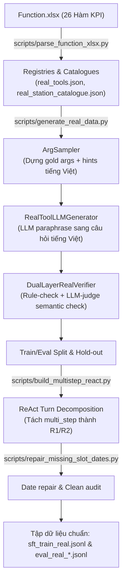

# Tài liệu Tổng hợp Quy trình & Pipeline Sinh Dữ liệu (Real KPI Dataset)

Tài liệu này tổng hợp chi tiết triết lý sinh dữ liệu, cấu trúc pipeline end-to-end và cách các case dữ liệu (bao gồm cả phân hệ dễ và phân hệ khó - hard splits) được tạo ra trong codebase hiện tại phục vụ dự án Telco Function Calling.

---

## 1. Triết lý Thiết kế: "Construct-then-Paraphrase"

Trái ngược với cách tiếp cận truyền thống là dùng LLM sinh đồng thời cả câu hỏi và lệnh gọi hàm (dễ dẫn đến lỗi hallucinate về mã trạm, ngày tháng, tên tham số), hệ thống áp dụng triết lý sinh đảo ngược thích ứng từ ToolACE:

1.  **Dựng Gold trước (Tất định)**: Bộ tham số gọi hàm (Arguments) được rút trích ngẫu nhiên từ catalogue đóng của Viettel KPI (bao gồm 48 Location, 12 KPI code, 9 Unit code, 144 Station code). Quy luật ngày tháng cũng được tạo tự động đảm bảo lô-gíc thời gian thực tế.
2.  **Viết câu hỏi sau (LLM Paraphrase)**: LLM chỉ chịu trách nhiệm viết lại đặc tả kỹ thuật của Gold thành câu hỏi tiếng Việt tự nhiên của người dùng.
3.  **Hệ thống Dual-Layer Verification (DLV)**: Lọc sạch lỗi thông qua kiểm tra cú pháp/rule cứng kết hợp LLM-judge xác thực ngữ nghĩa.

---

## 2. Pipeline Sinh Dữ liệu End-to-End

Quy trình xử lý dữ liệu được thiết kế thành một luồng khép kín từ file đặc tả KPI gốc đến tập tin SFT hoàn chỉnh:

### Các Bước Chi Tiết Trong Pipeline

1.  **Khởi tạo Catalogue (`parse_function_xlsx.py`)**: Đọc dữ liệu từ file đặc tả hàm, sinh ra schema JSON cho 26 hàm KPI (18 seen, 8 unseen) và trích xuất bảng ánh xạ mã địa bàn/trạm.
2.  **Lấy mẫu tham số (`ArgSampler`)**: Lấy mẫu tham số ngẫu nhiên theo 3 mức độ khó (simple, medium, complex) xoay vòng địa lý và thời gian. Kết quả trả về gồm bộ `arguments` (cho gold call) và `hints` (từ khóa tiếng Việt tương ứng).
3.  **Paraphrase bằng LLM (`RealToolLLMGenerator`)**: Sử dụng vLLM với model Qwen3-32B để chuyển đổi hints thành câu hỏi tiếng Việt. 
4.  **Xác thực kép (`DualLayerRealVerifier`)**: 
    *   *Layer 1 (Rule-based)*: Validate kiểu dữ liệu, bắt buộc phải có, kiểm tra giá trị nằm trong danh sách catalogue, logic ngày tháng (`from_date <= to_date`), và ràng buộc độ dài.
    *   *Layer 2 (Semantic-based)*: Dùng LLM đánh giá xem câu hỏi có chứa đủ thông tin để gọi hàm hay không.
5.  **Phân rã ReAct (`build_multistep_react.py`)**: Tách các case 2 bước gọi hàm thành hai record đơn lượt `react_step1` và `react_step2` để phục vụ huấn luyện turn-by-turn.
6.  **Hậu xử lý & Sửa lỗi**: Sửa lỗi logic ngày tháng của missing slots (chỉ lược bỏ ngày tháng theo cặp để tránh mất lô-gíc) và chạy audit độc lập 100% để đảm bảo 0 defect.

---

## 3. Cách Sinh Chi Tiết Các Case (Dataset Families)

Dữ liệu huấn luyện và đánh giá tiêu chuẩn được chia thành 7 họ (Families):

| Họ dữ liệu (Family) | Cách sinh | Expected Action / Gold |
| :--- | :--- | :--- |
| **`single_step`** | Lấy mẫu tham số hợp lệ ngẫu nhiên và gửi hints cho LLM sinh câu hỏi tương ứng. | `call_function` với tool và tham số đầy đủ. |
| **`missing_slot`** | Lược bỏ 1 tham số bắt buộc trong câu hỏi (nếu bỏ date thì bỏ cả cặp `from/to_date`) để ép model phải hỏi lại. | `ask_clarification` liệt kê tham số thiếu + `checker_call`. |
| **`masking`** | Chuyển đổi tên tool thật thành `func_X` hoặc tham số thành `param_X`, schema masking được nhúng trực tiếp vào prompt để tránh model ghi nhớ tên tool. | `call_function` với tên tool đã mã hóa. |
| **`parallel`** | Ghép 2 tool gọi song song (chung location và date) và paraphrase gộp 2 yêu cầu lại. | `call_functions` chứa danh sách 2 cuộc gọi. |
| **`multi_step`** | Ghép 2 tool phụ thuộc (bước 1 tìm trạm ở địa bàn $\rightarrow$ bước 2 lấy KPI của trạm đó). Đầu vào bước 2 mang placeholder `<from_step_1>`. | `call_functions` chứa chuỗi gọi hàm (sau đó phân rã sang ReAct R1/R2). |
| **`abstain`** | Yêu cầu LLM tự động sinh các câu hỏi ngoài phạm vi tra cứu KPI viễn thông (ví dụ: cước phí, gói data, cắm trại, nấu ăn...). | `abstain` kèm lý do từ chối. |
| **`from_seed_examples`** | Sử dụng các câu hỏi mẫu do chuyên gia viết sẵn từ file xlsx ban đầu (phục vụ đánh giá unseen tools). | `call_function` dùng cho unseen evaluation. |

---

## 4. Các Case Đánh Giá Khó (Hard Evaluation Splits)

Để kiểm tra độ bền bỉ và khả năng tổng quát hóa thực sự của mô hình, codebase định nghĩa thêm một pipeline sinh dữ liệu khó riêng biệt thông qua [scripts/gen_hard_eval.py](file:///Users/mac/Documents/Projects/telco_function_calling/scripts/gen_hard_eval.py) (tạo ra 4 file `eval_real_hard_*.jsonl`):

### 4.1. Hard Seen (`eval_real_hard_seen.jsonl`)
*   **Rare Locations (Địa bàn hiếm)**: Lấy các địa bàn ở vùng sâu vùng xa/hiếm gặp thay vì các thành phố lớn để tránh thiên kiến tần suất.
*   **Semantic Disambiguation (Giải quyết nhập nhằng)**: Tạo câu hỏi sử dụng các mô tả dễ gây nhầm lẫn giữa 2 tool tương tự (ví dụ: nhầm lẫn giữa chỉ số đo từ thiết bị đầu cuối `speedtest_province` với dữ liệu đo từ mạng lõi OSS `download_throughput_oss`).
*   **No Keyword Overlap (Không đè khớp từ khóa)**: Diễn đạt câu hỏi hoàn toàn bằng từ đồng nghĩa, tránh trùng lặp từ khóa trực tiếp với tên hay mô tả tool trong schema.

### 4.2. Hard Missing (`eval_real_hard_missing.jsonl`)
*   **Multi-Drops**: Lược bỏ đồng thời nhiều tham số bắt buộc cùng lúc (ép model phải hỏi lại tất cả các tham số thiếu).
*   **Natural Omission (Lược bỏ tự nhiên)**: Câu hỏi được diễn đạt tự nhiên bỏ qua mốc thời gian hoặc khu vực mà bình thường con người hay lược bớt.
*   **Rare Slots**: Lược bỏ các tham số không phổ biến.

### 4.3. Hard Parallel (`eval_real_hard_parallel.jsonl`)
*   **Implicit Parallel**: Ghép 2 tool gọi song song nhưng câu hỏi viết ẩn ý không chứa các từ nối tường minh như *"cả hai"*, *"đồng thời"*, hay *"vừa... vừa..."* để thử thách khả năng phát hiện đa ý định.

### 4.4. Hard Abstain (`eval_real_hard_abstain.jsonl`)
*   **Adjacent Negatives**: Sinh các câu hỏi mang thuật ngữ kỹ thuật viễn thông rất cao nhưng là tác vụ không hỗ trợ (ví dụ: provisioning/billing như đăng ký eSIM, hủy 4G, cấu hình thiết bị trạm tại chỗ...). Điều này ép model phải từ chối thay vì cố gắng gọi hàm KPI bừa bãi.

---

## 5. Phương Pháp Huấn Luyện Các Case Multi-Step

Như đã phân tích, để giữ cho pipeline SFT và eval đơn giản (single-turn), các case `multi_step` được chuyển dịch thành mô hình **ReAct Turn-Level**:

1.  **Phân rã R1 và R2**:
    *   **R1 (Turn 1)**: Huấn luyện model nhận dạng câu hỏi phức hợp $\rightarrow$ gọi tool trung gian `regional_station_info`.
    *   **R2 (Turn 2)**: Sử dụng kịch bản hội thoại tiếp nối, nhúng kèm kết quả giả lập (danh sách trạm thật trả về từ catalogue) làm phần đầu câu hỏi mới. Huấn luyện model đọc danh sách này, nhặt ra `station_code` và truyền làm tham số `object_code` cho tool đích.
2.  **Shuffling & Mixing**: R1 và R2 được shuffle độc lập và đưa vào tập train cùng với public warmup, giúp mô hình học khả năng tư duy từng bước mà không cần cấu trúc hội thoại đa lượt phức tạp.
